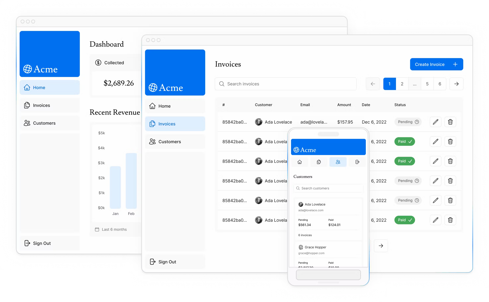
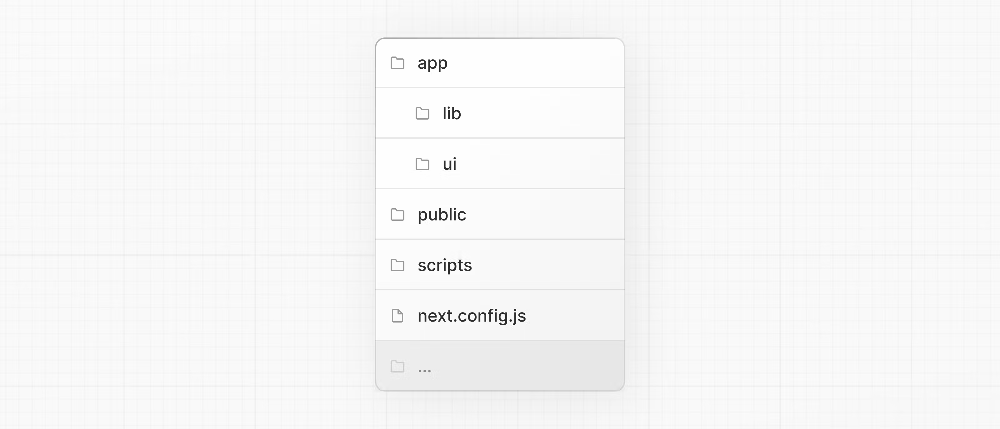

## Next.js App Router Course - Starter

This is the starter template for the Next.js App Router Course. It contains the starting code for the dashboard application.

For more information, see the [course curriculum](https://nextjs.org/learn) on the Next.js Website.

## Day 1 - Building a Next.js App

Next.js is a React framework that helps launch high performance web applications.

It includes features like...

- Styling: The different ways to style your application in Next.js.
- Optimizations: How to optimize images, links, and fonts.
- Routing: How to create nested layouts and pages using file-system routing.
- Data Fetching: How to set up a database on Vercel, and best practices for fetching and streaming.
- Search and Pagination: How to implement search and pagination using URL Search Params.
- Mutating Data: How to mutate data using React Server Actions, and revalidate the Next.js cache.
- Error Handling: How to handle general and 404 not found errors.
- Form Validation and Accessibility: How to do server-side form validation and tips for improving accessibility.
- Authentication: How to add authentication to your application using NextAuth.js and Middleware.
- Metadata: How to add metadata and prepare your application for social sharing.

Over the next several days, I'm going to be building a Financial Dashboard in Next.js and following along with the tutorial.

You can check out my code here:
https://github.com/ninjasort/ninja-app

---

The first step to building this Next.js application was to scaffold the project.

You can use create-next-app to do that.
https://nextjs.org/docs/app/api-reference/create-next-app

yarn create next-app@latest nextjs-dashboard
--use-yarn
--example "https://github.com/vercel/next-learn/tree/main/dashboard/starter-example"

## Day 2 - Building a Next.js App

Today I'm going over the folder structure of this Next.js app.

Here's how it breaks down:

- /app: Contains all the routes, components, and logic for your application, this is where you'll be mostly working from.
- /app/lib: Contains functions used in your application, such as reusable utility functions and data fetching functions.
- /app/ui: Contains all the UI components for your application, such as cards, tables, and forms. To save time, we've pre-styled these components for you.
- /public: Contains all the static assets for your application, such as images.
- /scripts: Contains a seeding script that you'll use to populate your database in a later chapter.

To get the project up and running we can run `yarn run dev`.

Most of the time we are working in the /app folder.

What's nice about Next.js is that all the routes are based on the folder structure.

/app/dashbaord is the route `/dashboard`
/app/dashboard/invoices is the route `/dashboard/invoices`

## Day 3 - Building a Next.js App

Today I was working on setting up Pagination for this Next.js app.

To do that I used the React hooks from 'next/navigation'.

With these hooks I was able to access the pathname and query parameters to create a page URL.

Once the URL is created, I am reading the parameters and rendering the pagination component with the correct state.

This state includes currentPage and totalPages which are both of type Number that I'm using to calculate the pagination prev/next buttons.

## Day 4 - Building a Next.js App

Today we're building invoices and using the Vercel Postgres module to push data to the cloud.

Check out the app here: https://ninja-app-phi.vercel.app/dashboard

One of the features of Next.js is the ability to cache route data in the browser cache.

This makes the app fast because data doesn't need to load from the server when navigating the client side.

However, when you update new data you want to revalidate the cache so that it's the latest and greatest!

Finally always redirect the user to the route that shows the result of their create operation. 

In this case, we're going to `/dashboard/invoices`

